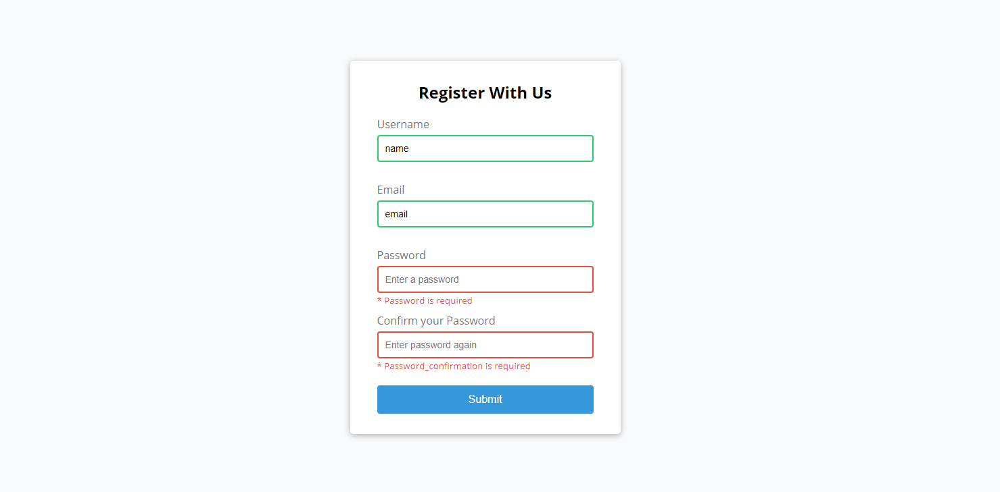

<h1 align=center>Form validator 📋 </h1>

This project is about a form validator.

**Technologies used:**

✔️HTML
 
✔️CSS
 
✔️Vanilla javaScript
 

**Tools:**

- Neo Vim

You can see a live preview here: https://andres-condezo.github.io/form/
